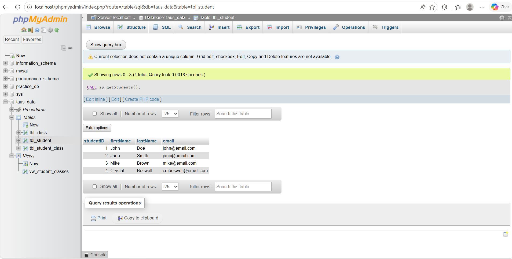

# Student Database Project (Chapter 11)

## 📌 Project Overview

This project demonstrates the design and implementation of a relational database using MySQL within phpMyAdmin (AMPPS). It includes table creation, relationships using foreign keys, data insertion, SQL queries, views, and stored procedures. Additionally, a basic PHP front-end page is included to display project information.

---

## 🗄️ Database Design

**Database Name:** `taus_data`

### Tables Created:

* **tbl_student**

  * studentID (Primary Key, Auto Increment)
  * firstName
  * lastName
  * email

* **tbl_class**

  * classID (Primary Key, Auto Increment)
  * className
  * location

* **tbl_student_class**

  * studentID (Foreign Key)
  * classID (Foreign Key)

### 🔗 Relationships:

* `tbl_student_class.studentID` → `tbl_student.studentID`
* `tbl_student_class.classID` → `tbl_class.classID`

These relationships enforce referential integrity and ensure accurate data linking between students and classes.

---

## 📊 Data Implementation

Sample data was inserted into all tables using phpMyAdmin. Each table contains a minimum of three records to demonstrate relational functionality.

---

## 🔍 SQL View

A view was created to display students along with their enrolled classes:

**View Name:** `vw_student_classes`

This view joins all three tables to present a combined dataset including student information and class details.

---

## ⚙️ Stored Procedures

### 1. `sp_getStudents`

Returns all student records.

### 2. `sp_getStudentByEmail`

Accepts an email parameter and returns the matching student record(s).

### 3. `sp_insertStudent`

Accepts first name, last name, and email as parameters and inserts a new student into the database.

All stored procedures were tested successfully using the SQL `CALL` command in phpMyAdmin.

---

## 🌐 Web Component

A basic PHP page (`index.php`) was created to demonstrate integration with a web environment.

### Features:

* Project title
* Student name
* Dynamically generated current date using PHP

---

## 🎨 Styling

A CSS file (`styles/main.css`) was implemented to enhance the appearance of the webpage, including:

* Font styling
* Background color
* Spacing (margins and padding)

---

## 📸 Screenshot

The following screenshot demonstrates the successful execution of a stored procedure:

---

## 🛠️ Technologies Used

* PHP
* MySQL
* phpMyAdmin
* AMPPS
* Visual Studio Code
* Git & GitHub

---

## ✅ Conclusion

This project successfully demonstrates core database concepts including relational design, data integrity through foreign keys, query creation, and stored procedure implementation. The integration with a PHP front-end provides a foundation for building dynamic, database-driven web applications.

---
